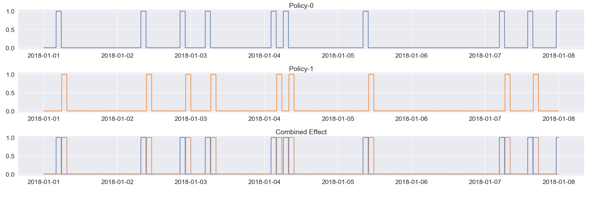
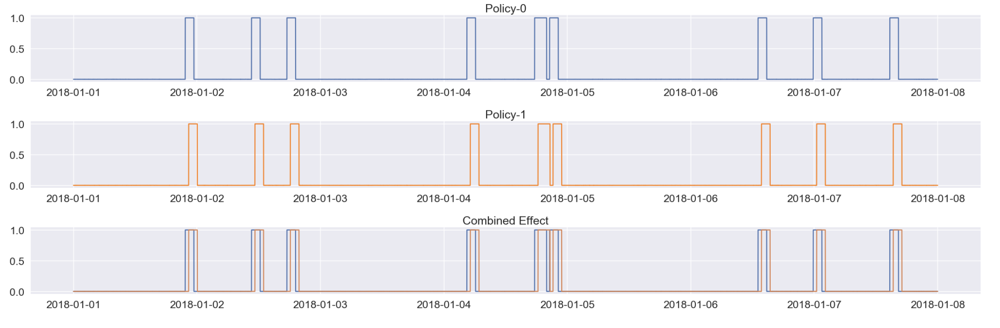

## Problem
Open Cluster management using Policies to control security and configuration management across a fleet of clusters from a central Hub Server. It is feasible that in a large system where mutliple policies are getting applied to the clusters in the fleet - by different people using different labels - there may be an inadvertent conflict. A policy-0 for example may change an object which may cause another policy-1 to trigger. Signals could behave as shown below:

#### Type-1

#### Type-2

## Solution
This notebook looks at the data and attempts to conclude definitively if policy-0 (granger) causes policy-1. A representative run is captured in the notebook.

### Note: 
There is rudimentary synthetic signal generated in the code to best approximate the use case for now till we can get a good set of real data. 

## Further Use
Can this be used to detect if one alert (goes hi and lo as this signal) triggers another alert? Of course one logical followup on this would be: `how to derive a subset of signal which may be casually related from a large set of signals`

## Alternatives
This notebook just explores Granger Analytics to determine causation. However, we will be testing other approaches that uses distance based algorithms which may be less suspectible to the lags.